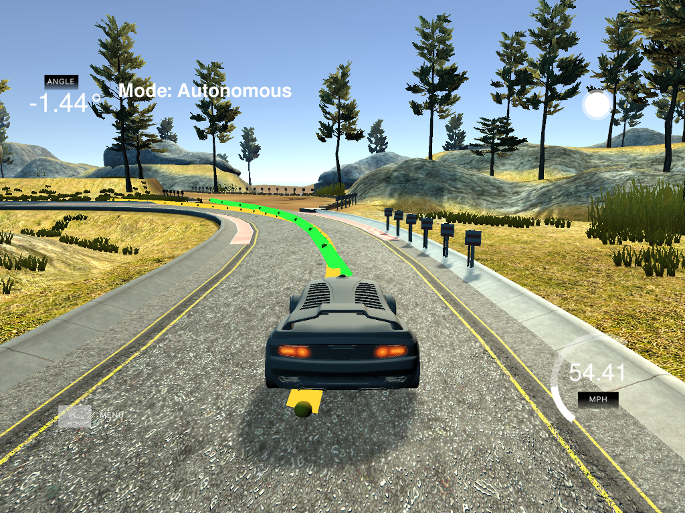
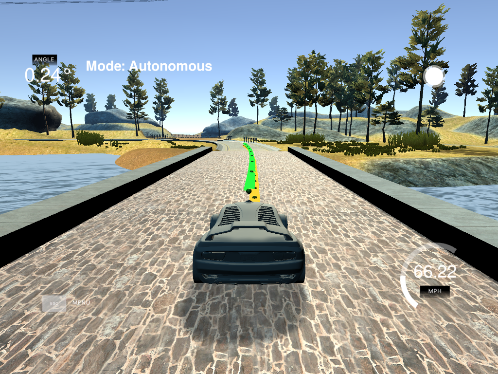

# Model Predictive Control (MPC)

## About MPC

Model Predictive Control (MPC) uses the dynamic process of the dynamical model and the state during a finite time-horizon. This way, by knowing the state for the next n steps, we can optimize the actuators and anticipate changes in the trajectory by taking into consideration the dynamical model of the car.

## Compiling and executing the project

- Clone the repo and cd to it on a Terminal.
- Create the build directory: `mkdir build`.
- `cd build`
- `cmake ..`
- `make`: this will create the executable `mpc`, that contains a program that reads the input from the simulators and computes the mpc.

`mpc` communicates with a Udacity simulator that reads the input data and produces estimations for the object and trajectories. See [Udacity's seed project](https://github.com/udacity/CarND-MPC-Project) for more information on how to install the simulator.

Open the simulator and run `./mpc` to enable the connection. Select Project 5 from the simulator.

## Implementation

The project computes a few values; some of them are actuators to modify the trajectory of the car, and the others are trajectory information:

- Steering angle: what is the angle we need to move the car to follow the desired trajectory.
- Throttle: how much we need to accelerate or break the car to follow the desired trajectory.
- Trajectory to follow: to be represented in the simulator to get an idea of the movement the car should follow.
- Trajectory the car would follow with the current actuator (mpc predicted trajectory)

The code tries to find the actuators that, given certain dynamics of the model, would minimize the trajectory error, by using an approximation of the trajectory using polynomial curve fitting. This part is implemented in MPC::Solve.

I tried to organized the code to make it easier to follow, by dividing a bit the code into logical methods, to make the whole structure more readable.

## Description of the model

For this project, I worked with a model using a state (represented by x, y coordinates, the orientation of the vehicle (psi), the velocity (v), the error between the desired trajectory and the vehicle (cte), and the orientation error (epsi).

As mentioned before, we are using two actuators: steering angle and throttle, which act as inputs into the vehicle, changing the state of the vehicle with respect to the world. To simplify computation, I consider the state to be centered at the vehicle at all times, using the desired trajectory relative to the vehicle.

The update equations are written in the updatePrediction method of FG_eval:

fg[1+x_start+t] = x1 - (x0 + v0 * CppAD::cos(psi0) * dt);
fg[1+y_start+t] = y1 - (y0 + v0 * CppAD::sin(psi0) * dt);
fg[1+psi_start+t] = psi1 - (psi0 - v0 * delta0 / Lf * dt);
fg[1+v_start+t] = v1 - (v0 + a0 * dt);
fg[1+cte_start+t] = cte1 - ((f0 - y0) + (v0 * CppAD::sin(epsi0) * dt));
fg[1+epsi_start+t] = epsi1 - ((psi0 - psides0) - v0 * delta0 / Lf * dt);

## Chosing N and dt

For the choice of N and dt I ended up choosing N=10 and d=0.1. Higher values of N seemed to be optimizing for positions far ahead of the vehicle, which did not imply improved precission, since the vehicle has enogh time to correct the trajectory via actuators with smaller N.

Changes on dt make the distance for each predicted value change. Smaller values will decrease the increments while higher values would increase it. I found that a value of dt = 0.1 is consistenly good, even when changing the value of N, while a decreased value (0.05, for instance) ended up diverging at some point (same with higher values). 0.08 and 0.12 also seem to work fine, but increased values usually tend to undershoot and decrease the speed of the car on the turns.

## Fitting wayponts with polynomial

Since I am using car coordinates through the simulation, I needed to compute the waypoints (and transform to the car coordinates), which is done in the method coordinateTransformation. A certain latency is also added to the state (method addLatency).

The main equations for this change are:

double tx = x[i] - px;
double ty = y[i] - py;
x[i] = tx * cos(-psi) - ty * sin(-psi);
y[i] = tx * sin(-psi) + ty * cos(-psi);

Where (px,py) are the coordinates of the car, and (x,y) the waypoints.

I also compute for visual comparison the reference line that shows the "ideal" trajectory (method computeReferenceLine).

## Latency method

To add some latency into the system (100ms), I update the data received from the sensors using the following equations:

px += v * cos(psi) * latency; // x position updated with the x component of the velocity * dt.
py += v * sin(psi) * latency; // y position updated with the y component of the velocity * dt.
psi -= v * delta / Lf * latency; // updating the angle of the car.
v += a * latency; // velocity updated with the acceleration * dt.

Then, we simulate the latency of the sensors by sleeping the input method 100ms.

## Problems during the implementation 

A bug I had for a while, was the use of numerical limits for lower and upper bounds for the vars. I wasted a lot of time assuming that numeric_limits<double>::min() and max() were what I needed, but the code did not work (weird actuator signals).

## Results

The vehicle was able to drive around the circuit at up to 85mph without crossing the yellow lines.

